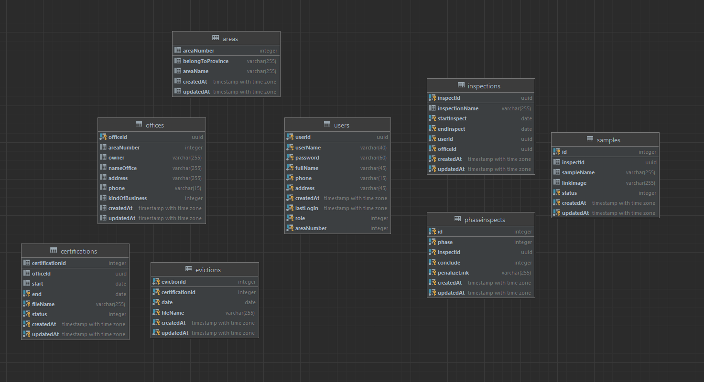

    Ứng dụng để giúp chi cục an toàn vệ sinh thực phẩm  trong  công tác  quản lý các cơ sở sản xuất thực phẩm hoặc kinh doanh dịch vụ ăn uống
     
    <a href="https://trungvandeptry.uetbc.xyz/api-docs/">View Demo</a>
    ·
    <a href="https://github.com/Kientrung1202/HealthyFood/issues">Report Bug</a>
    ·
    <a href="https://github.com/Kientrung1202/HealthyFood/issues">Request Feature</a>
  

***
## About The Project
***
  Hệ thống có 3 user: chuyên viên (expert),quản lý (quản lý), admin.
 ***

 ### Link swagger: 
 Do chưa quen viết swagger nên viết tayy, hơi phèn
 * [Api-docs](https://trungvandeptry.uetbc.xyz/api-docs/)
### Built With

Frameworks and technology using to build this project:
* [Nodejs](https://nodejs.dev/)
* [Express](https://expressjs.com/)
* [Postgresql](https://www.postgresql.com/) and use [Sequelize](https://sequelize.org/)
* [Typescript](https://www.typescriptlang.org/)
* [Docker](https://www.docker.com/)
***
### Getting started
To get a local copy up and running follow these simple example steps.
- Create file .env have the same structure with .env.example
- CMD: docker-compose up --build -d
- Server is running on your port you configured
***
### Prerequisites
[Todo]
***
### Installation
[Todo]
***
### Database
- Postgresql is used in this project
- Entity Relation Diagram
 

  

